+++
title = "嵊州中翔雷迪森酒店二日游"
description = ""
date = 2019-12-13
[taxonomies]
authors = ["爸爸"]
categories = ["游"]
tags = ["酒店"]
+++

## 出发
出发之前最麻烦的就是收拾东西了，由于是温泉酒店，除了日常的东西之外，泳衣是必需品。当然了，有钱什么都能买。这次出去还给气气带了滑板车，事实证明没什么必要，一方面是因为气气还不会划，另外酒店在山上，路都有坡度，比较危险。比较失策的是忘了带足球了，酒店边上有3片大草坪，挺适合小孩子运动的。另外，酒店没有沙坑。。。傻傻的带了挖沙工具。

刚从家出发的时候，气气一直喊着风息堡我来了，《小猪佩奇》看多了。。。

路上不是一帆风顺，走到杭州湾环线高速（G92）距离绍兴服务区还有将近20km的地方遇到了大堵车。起先从很远的地方就看见了浓烟，不过开过去发现是对向车道，一辆小车起火。此时交警已经赶到，但是消防还没有到，只能划出安全区域，看着小车在那里烧。这应该是第二次在路上看见着火的小车了。

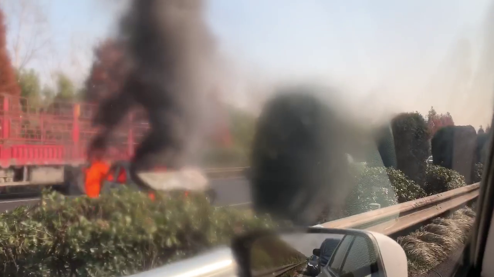

过了事故点，才知道同向车道堵车是因为施工，大早上的在高速公路上划线。。。直接用了两个车道啊！堵了半个小时，过了拥堵路段，小气气就抗不住睡着了。我们也到了绍兴服务区做了简单的修整。绍兴服务区是四星级服务区，各种设施都还不错（起码和返程的诸暨服务区比好多了），看起来以后选择服务区，特别是需要吃饭的服务区，一定要找一个有星巴克的。。。

之后的高速才能称得上高速，虽然后来转的常台高速（G1522）限速只有100km/h，转过去的时候还因为没注意导航，跨了2条实线变道。。。

下了高速，没走多少路就上了盘山路。这里盘山路感觉还比较好开，除了快到酒店有一段连续弯道，其他弧度都不大，也没有悬崖什么的。上了县道之后，一路都有牌子指向温泉城，也不会迷路。另外，快到酒店的时候，还真有一个像烽火台一样的“风息堡”，应该是温泉城范围了。不过由于距离酒店比较远，后来也没再来玩。

## 酒店
酒店整体比较小，后来了解到，这里算是温泉城酒店二期，定位只有吃饭和住宿，除此之外没有任何配套设施。所以温泉酒店，能玩的就是温泉，一晚足矣。

最终我们住的是2间朝北的房间，没有太阳，不过听说这个酒店还有“假窗房”。。。问了前台，如果要升级亲子房，需要加300,果断放弃。另外，由于周六晚上没有空房，两间房都是双窗，只能把两个床拼起来。

房间整体比较小，没有浴缸，厕所和淋浴间也挺小。房间里面配有茶具，看着挺高端，有小罐红茶和绿茶。床头有一个钟，但是看上去这个钟是插电的，所以比较鸡肋，重新插卡取电之后，就变成00：00,奶奶还因此看错时间了。。。而且这个钟比较亮，后来晚上睡觉的时候我直接朝下翻转。

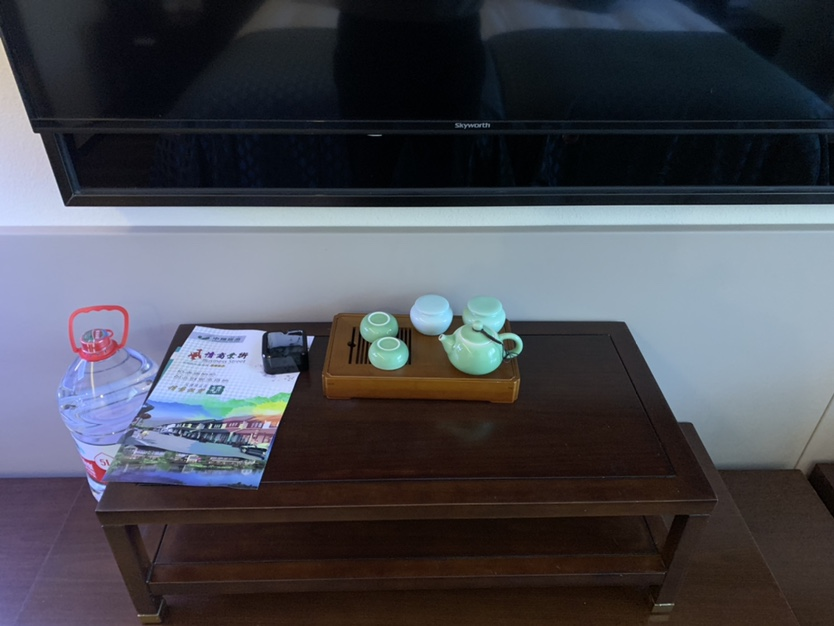

午饭在酒店餐厅解决，直接吃的套餐。餐厅提供了两种双人套餐，对我们来说刚好两个套餐各一份。套餐整体还比较实惠，50一份，菜量也还行。餐厅提供宝宝餐具，但是需要和服务员说才会拿过来。当时刚好有团队开会包了自助，问了下要188一位。

总结下对酒店印象：
1. 房间比较小，小孩子跑动容易发生磕碰。
2. 客房服务一般，第二天才发现我们房间放了2瓶洗发水，没有沐浴露。第二天的客房打扫一直到下午才进行，这时候宝宝已经睡着了，只是让阿姨拿了2瓶水。
3. 餐厅套餐比较实在，但是没什么变化，总不能连续吃套餐吧。
4. 早餐还算丰富，第一天（周六上午）还有咖啡机，第二天就变成泡好的速溶咖啡了。。。培根等配菜味道不错，还有酸奶什么的。
5. 大堂比较小，二楼大堂男厕所像客房厕所，上厕所得上锁。导致给气气去尿尿的时候门锁了，只能让妈妈上了。
6. 周围环境比较好，有三块大草坪，一个湖。但是房间里面看不到。

## 温泉
温泉酒店，特色当然是温泉了（除此之外，真的什么都没有了。。。）。温泉不在酒店这里，需要沿着盘山道走几分钟。看似不远，不过由于山路比较绕，需要特别注意小孩子不能乱跑。中间有几个弯比较大，看不到转角的人。路上还有公交车、洒水车等大型车辆。

由于我们的订的房间没有包含温泉，因此需要去温泉那边买票。我们去的时候是周五下午，因此几乎没什么人。出示了酒店房卡，可以按照108优惠价购买温泉票，加上一餐简餐一共是138一个人，小气气身高不到，不需要门票。温泉票当日有效，可以最晚到晚上10点。

之前我一直不太敢让气气去泡温泉，网上搜了很多内容，也都说不建议给小孩子去泡温泉。个人认为主要有两个问题：
1. 小孩子皮肤比较脆弱，容易吸收温泉里面各种东西，容易发生过敏的情况。
2. 温差比较大，从池子里面出来容易着凉。

这次给气气穿着连体的泳衣，同时多带了几条浴巾。在户外泡温泉的时候也只是泡泡脚，基本上没有整个身子浸到池子里去的。应该也是学习游泳的缘故，气气一直挺喜欢玩水。所以感觉对他来说：泡温泉 == 玩热水。中间换了池子，爷爷抱着擦干身子，看上去状态不错。

没敢泡太久，就去换了衣服，去休息室休息了。由于提供的衣服没有小气气能穿的，只能冲洗之后换成自己的衣服。休息室有饮料、水果，躺椅也挺舒服，但是躺椅下面的插座都没有电，枉费了我回去拿了充电器。休息室没有WIFI，洗手间也有点距离，抱着小气气去尿尿一路喊着“熬牢”。

天黑之后再和妈妈两个人出去泡，感觉整个区域就只有我们两个人了。整体有点太黑，要是能在还有夕阳的时候出来，看着湖景，应该别有风味。选择周五的最大优势，大概就是错峰了吧。

晚餐在温泉中心解决，由于餐厅在温泉区域之外，我们都换完衣服再去吃饭。简餐和食堂套餐差不多，一荤一素一杯紫菜汤。有5种套餐可以选择，但是其中的蔬菜都是一样的，妈妈不能吃，单点了一份蔬菜，也不贵，18一份。

温泉的总体印象：
1. 服务还可以，对设施和流程不熟悉也没关系，换衣服的地方会有引导。发现我带了手机，就给我了一个防静电袋；看见我拿着衣服给我装脏衣服的塑料袋。
2. 温泉种类还可以。我们只去了室外，红酒、牛奶、绿茶、桂花什么的，但是没找到硫磺池子，本来想杀杀菌，哈哈。
3. 吃饭价格能够接受，30一个人，上菜速度还行。

回来几天了，仔细观察了下气气皮肤没什么异常。针对给小孩子泡温泉，还是要注意点：
1. 别泡时间长了
2. 不要去加了稀奇古怪东西的池子
3. 小心着凉

## 无聊的第二天
前面提到了，酒店周围基本上没有配套，除了温泉也没什么可以玩的。第二天我们基本是都是在草坪上度过的。

酒店东面有一块大草坪，边上就是湖了。

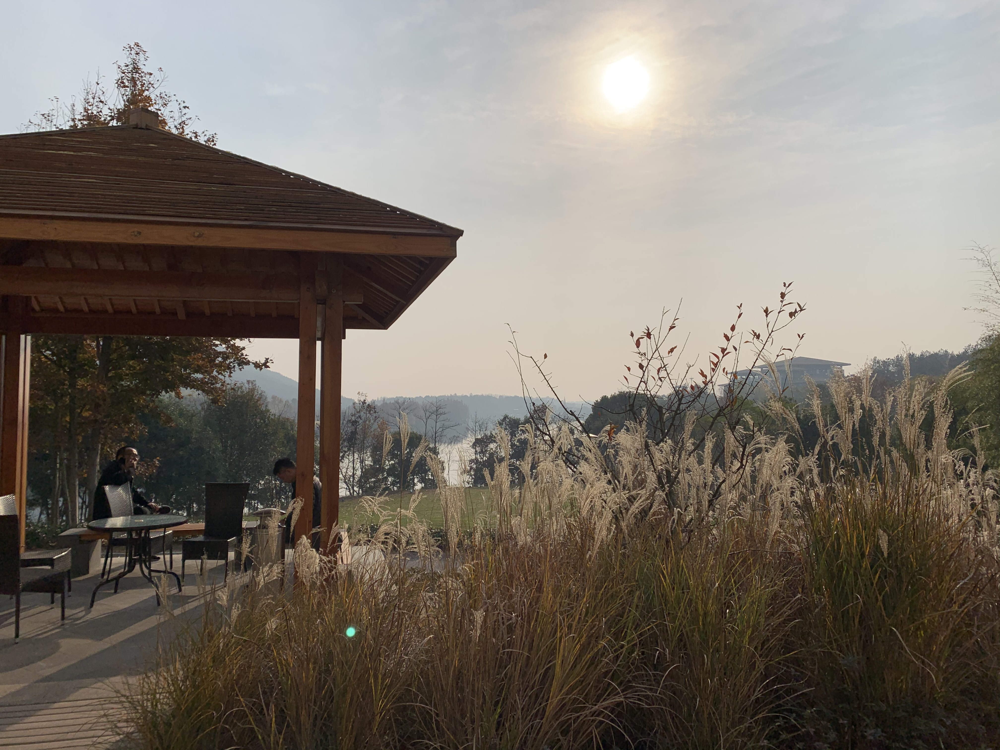
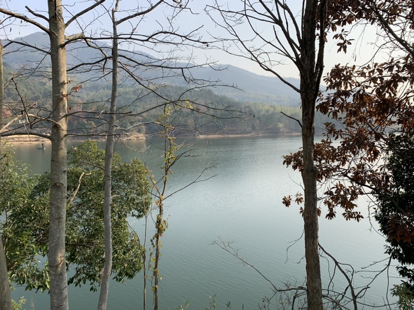

山里的早上，草坪上都是露水。气气玩着湿湿的落叶，挺后悔没有带他的小足球。

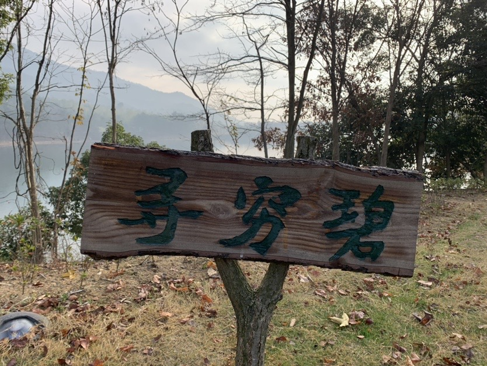
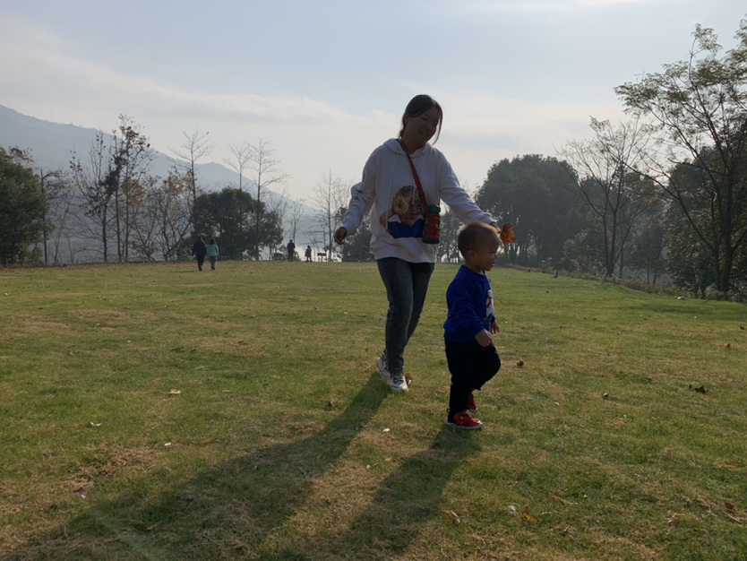

山上另外一个不方便的就是吃饭，除了酒店之外，看了点评，附近还有几家农家乐。在温泉边上是一个村子，村口的农宅自然是做起了生意。最终我们选择了最外面的一家，门口一条懒狗趴着睡觉。气气也不怕，走过去叫狗狗起床。吃饭环境不怎么样，等待时间也挺久。我们到了之后，可能是因为车子停路边了，又吸引了一大家子人来吃饭。

菜量还挺大，就是口味有点偏重。
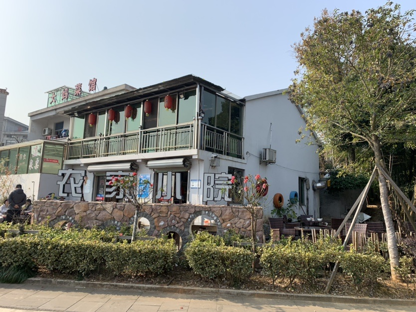
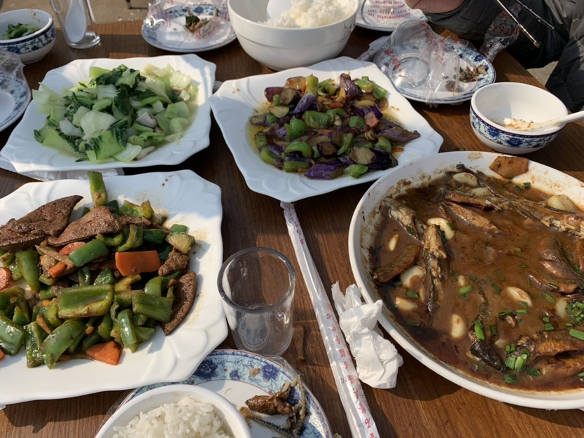

下午，酒店开始进行圣诞布置了，感觉除了门口的圣诞树，还是挺单调的。

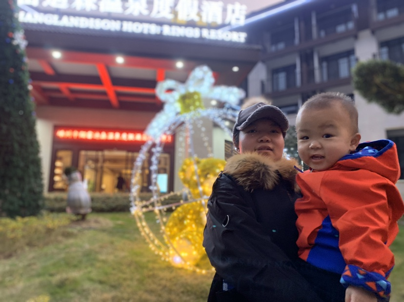

附上一段航拍视频：
{{dji(id="4ecf403e-4a96-430e-85f0-ebbbfab07ee6")}}

## 返程
第二天，本来决定吃完早饭就回去的。吃完饭爷爷遇到了以前的同事，了解到他们打算路过下古镇，我们也参考了这个行程。这里还想吐槽下周日早上的早餐，人有点多，刚开始位子都不好找。咖啡变成了速溶，煎蛋还要排队等候。感觉已经快到他们餐厅的人数上限了。

出发去崇仁古镇，这次走了另一边的山路。没有了盘山路，一路还是挺顺畅的，走县道什么的，最大的优势就是没有红绿灯。

虽然没怎么去过古镇，但是感觉崇仁古镇才是“真”古镇。里面保留了村落的各种古建筑，没有一点商业气息，看上去很多房子里面还有人居住。
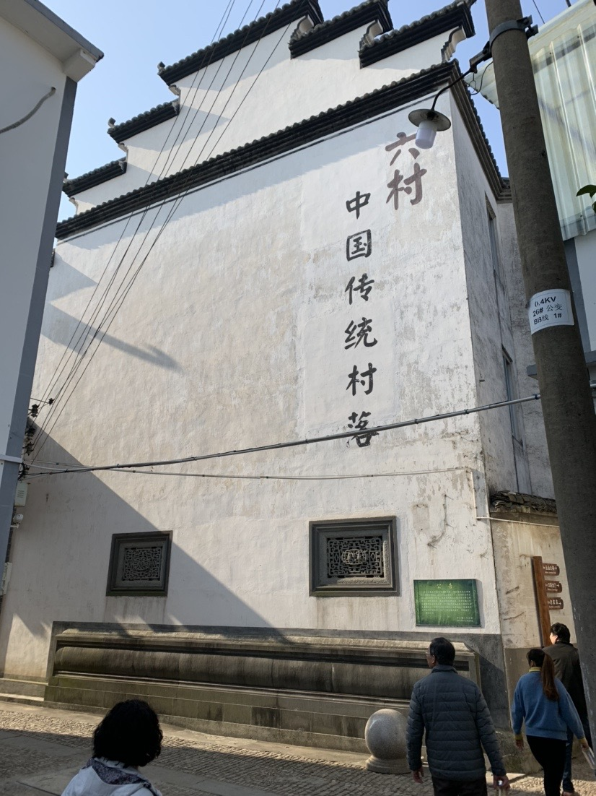
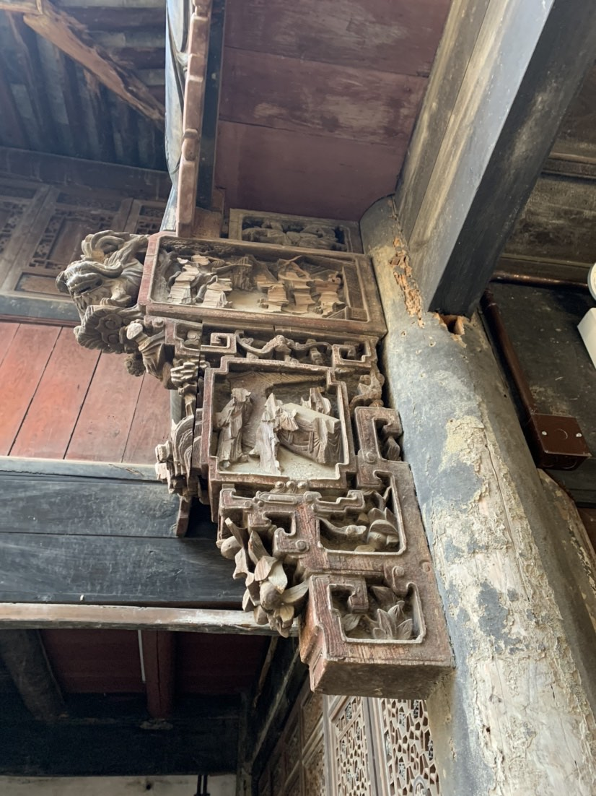
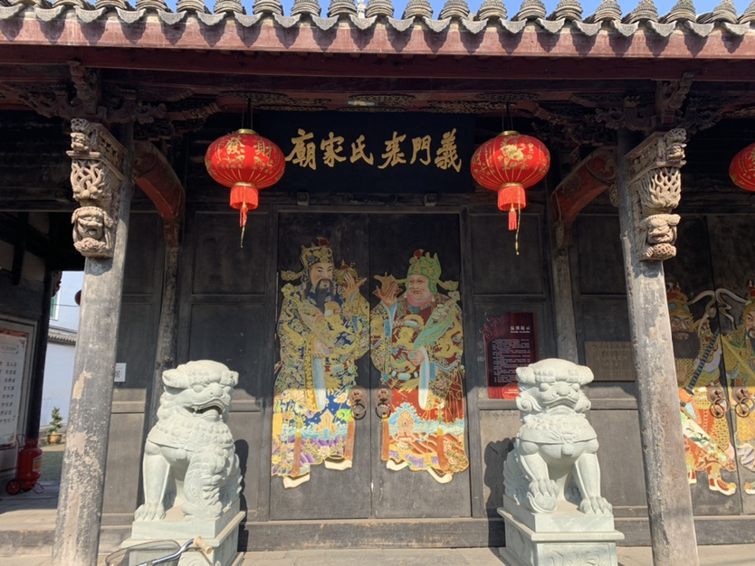

回程的小插曲，是高速的选择。古镇出来，走来的时候原路和走诸永高速（S26）时间差不多，但是因为杭州湾环线高速堵车路段比较多，最终算则了诸永高速，并且将午餐地点定在了诸暨服务区。然而诸暨服务区让人比较失望，午餐没什么可选的。因此才有最初的感叹，服务区要选择有星巴克的，起码有点可选的东西。

## 费用汇总
|项目|开销|
|--|--|
| 酒店第一天午餐（套餐2份） | 100 |
|温泉（x4，含简餐）   | 552  |
|温泉晚餐家菜   |  18 |
| 第二天午餐（农家小院）  | 143  |
| 酒店第二天晚餐  | 191  |
| 返程诸暨服务区午餐   | 115  |

总计：1119
